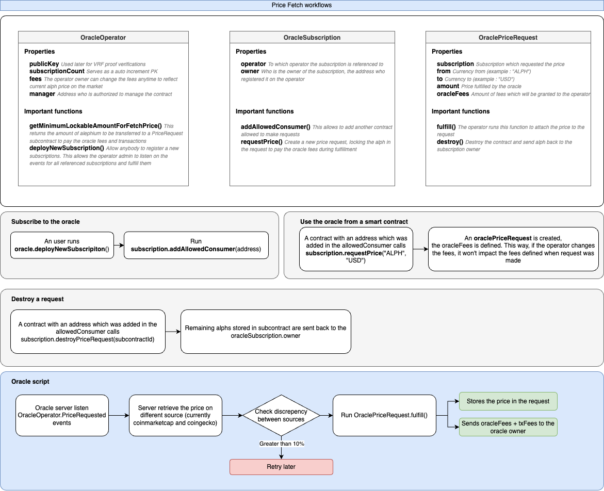

# Basic oracle example

> Important: This project is not production ready. It is a basic POC developed quickly to participate to the Hackathon. It requires security check, auditt and refactoring to be used in production.

## Oracle price fetch workflow



## Process to run and test the project

Assuming you got the local devnet installed on your mahchine following this guide : <https://wiki.alephium.org/full-node/devnet>

```bash
# Installing dependencies
npm install
rm -rf artifacts
# copy and exit the .env file (you only need to fill the coinmarketcap id to retrieve prices)
cp .env .env.local
nano .env.local
# Deploy the contracts. This will deploy : 
#  - The operator with all subcontract templates
#  - The sample dapp "MinimalistExchange" which is just an example, how to retrieve prices from the oracle
#  - It registers a subscription on the oracle and set the MinimalistExchange contract as a legit consumer
npx @alephium/cli@latest compile
# Sending some alph to the address which will deploy and own the MinimalistExchange contract
npm run build && node dist/src/send-alphs-to-exchange-demo-owner.js
# Deploying on devnet
npx @alephium/cli@latest deploy --network devnet
# Run the oracle agent -> This scipt listen the oracle events to fulfill requests as soon as they come
npm run build && node dist/src/operator-fullfill-requests.js
# Run the consumer -> It will either request a price or complete the process based on contract state
# -> When creating a price request, it locks alph into the request to store the contract and pay the oracle fees
# -> When completing process, it fetches the price from the request, stores it in itself, remove the subcontract and get the fees back (deducing the fees which were sent to the operator)
npm run build && node dist/src/minimalist-exchange-process.js
```

## Nextjs add example

You can also run the dapp example : https://github.com/maze2-org/alephium-hackathon-webapp.git

This app is an example of how to run a dapp which consume the oracle price feeder.
It also shows how to add / remove consumer for the subscription


## Start a local devnet for testing and development

Please refer to the documentation here: <https://wiki.alephium.org/full-node/devnet>

## Compile and deploys

Compile the TypeScript files into JavaScript:

```bash
npx @alephium/cli@latest compile && npx @alephium/cli@latest deploy --network devnet
```

The deploymnet script is actually deploying :

* All oracle contracts and templates for sub contract
* An dapp example which is using the oracle to retrieve the alph price in usdt

## Running the oracle

A basic scripting has been created. This is not a script to be run in production.
Ideally, a nestjs api would listen / store the requests to be performed and handle errors properly.

The script is actually a loop which executes request every 1s until you stop the script.

```bash
npm run build && node dist/src/operator-fullfill-requests.js
```

## Running the consumer

A script for the demo dapp was created. It will actually request a price fetch that will be fed by the oracle.

When you start the script, there are 3 possibilities :

* A price fetch was not requested : The script sign a transaction to request a price fetch
* A price fetch was requested and not answered by oracle : The script does nothing : "Waiting for the oracle to fulfill the request"
* A price fetch was requested and fulfuilled by oracle : The script stores the prices in the smart contract and destroy the request to retrieve the alphs

```bash
npm run build && node dist/src/minimalist-exchange-process.js
```

## TODO

* Handle the fees properly and send them to the operator owner.
* Create a docker to run the operator easily (so anybody could run an operator)
* Provide a website to manage subscriptions easily (display the owner subscriptions, manage their consumers, ...)
* Refactor the project in order to be able to import it as an npm dependency and use it as an external resource
* Implement the unit test
* Store the tokens / alph into the subscription in order to be able to use contract `assetsInContract` instead of storing (and approving them during execution)
* Auditing security

## Testing

Unit test have not been implemented yet.

```bash
npx @alephium/cli@latest test
```
